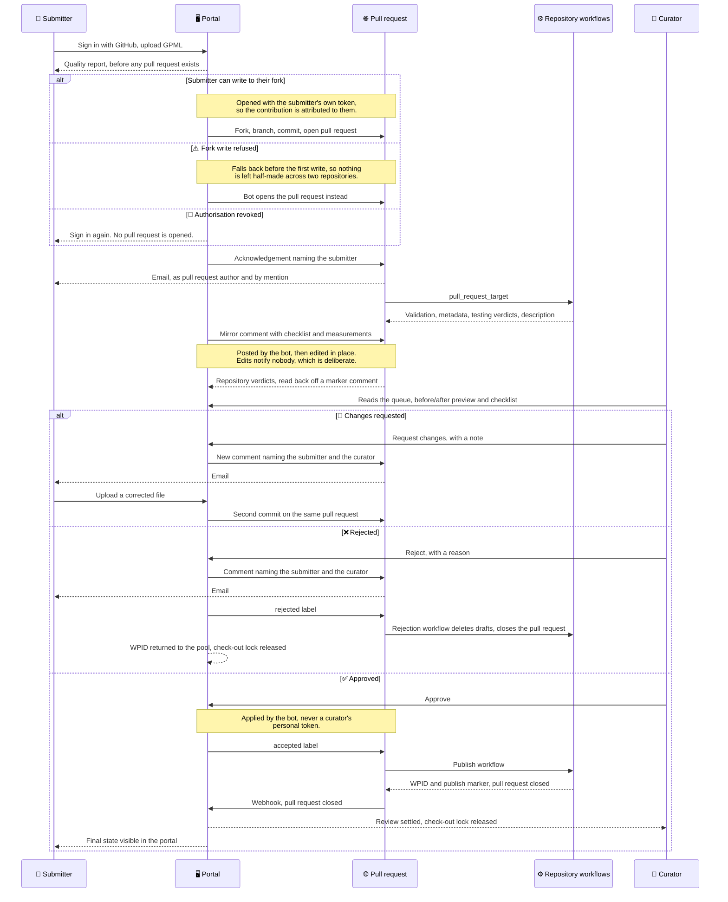

# Curation Portal

A hosted web app that is the front door for **submitting and curating WikiPathways pathways**
now that all content lives on GitHub. It lets anyone submit a new pathway or an update without
touching git, opens a real pull request against
[`wikipathways/wikipathways-database`](https://github.com/wikipathways/wikipathways-database),
assigns the WPID, and gives curators a review dashboard with a rendered before/after preview.

**Status: deployed for testing, not yet in production.** It runs at
[curation.wikipathways.org](https://curation.wikipathways.org) (and still answers on the older
`upload.wikipathways.org`) against the org's sandbox repository, where the whole
lifecycle — submit, revise, update, review, approve, publish — has been driven end to end against
live GitHub, including by third-party contributors from their own forks. It is **not** announced
and has no production users. Before it can serve the real content repository, two pre-existing
workflow defects there need fixing (see [`sandbox-workflows/`](sandbox-workflows/)), and the
curator list needs to be more than one person.

See [`docs/design-proposal.md`](docs/design-proposal.md) for the rationale, grounded in a
three-month audit of 51 pull requests, and [`docs/scaffolding-plan.md`](docs/scaffolding-plan.md)
for the build plan.

Licensed under [Apache-2.0](LICENSE). Note this covers the **code**; WikiPathways pathway content
is published separately under CC0.

## Why

The raw GitHub PR flow serves neither submitters nor curators: submissions arrive malformed
(no WPID, wrong filenames), concurrent GPML edits are unmergeable, WPIDs already collide across
in-flight PRs, and curators are asked to approve unreadable XML because the reviewable artifacts
(rendered SVG, data-node/reference tables) are only generated *after* merge. This app fixes the
altitude problem for both roles.

## What it does

- **Submit** (anyone, GitHub OAuth) — upload GPML → app assigns WPID, names/lays out files,
  opens a PR.
- **Update** (anyone) — check out a pathway (one editor at a time), upload a revision, PR off
  the latest `main`.
- **Preview** — render + validation runs on the PR and is shown in the dashboard and mirrored
  as a PR comment, so review happens on the pathway, not the XML.
- **Curate** (whitelisted ~20 curators) — dashboard with before/after render, checklist, and
  one-click approve-that-merges.

## How information moves

Every message exchanged during one submission, including who is notified and by what. Three things
are easy to get wrong from prose alone and are worth reading off the diagram: the branch and pull
request are opened with the **submitter's own token**, so the contribution is genuinely theirs; the
mirror comment is **edited in place** after its first post, which is why it is not the thing that
notifies anyone; and every fallback happens **before the first write**, so a submission never ends
up half-made across two repositories.

Two identities act on GitHub, deliberately. The **submitter's OAuth token** pushes the branch and
opens the pull request, so authorship is real. The **GitHub App** posts comments, applies labels
and receives webhooks, because those must not be attributed to a person. A rejection returns the
WPID to the pool; a publication keeps it, because by then it is a real WikiPathways identifier.

## Boundary

This repo holds the app, dashboard, WPID/lock registry, GitHub App, and deployment. The only
change to `wikipathways-database` is one added Actions workflow that renders + validates on
`pull_request`. The app talks to the content repo purely through the GitHub API.
